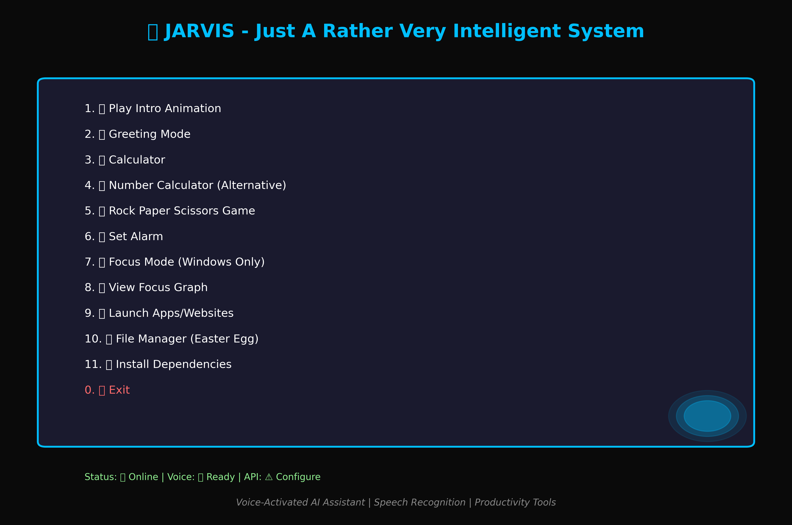
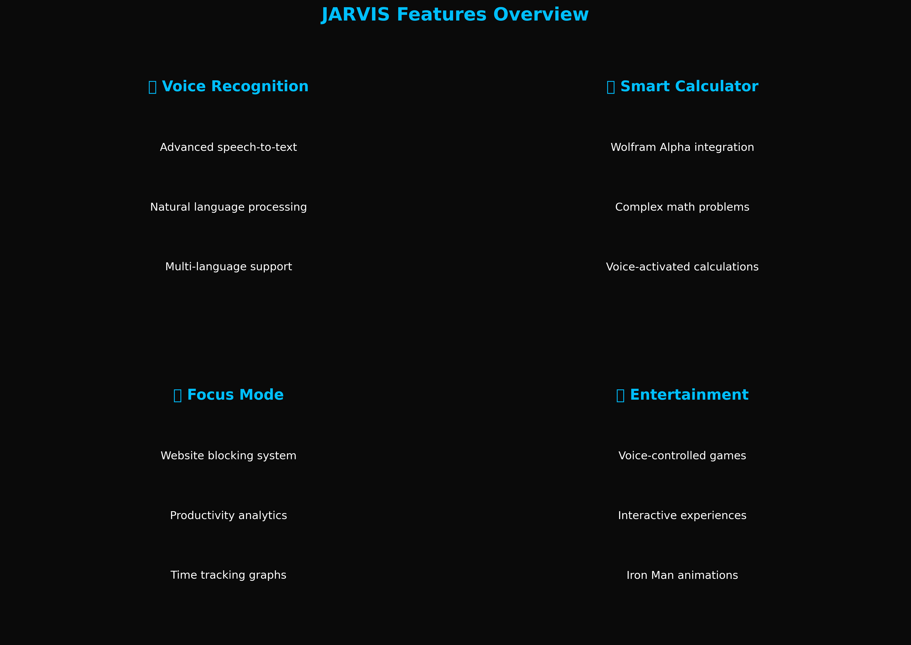

# 🤖 JARVIS - Just A Rather Very Intelligent System

[](https://www.python.org/downloads/)
[](LICENSE)
[](#compatibility)

A sophisticated Python-based voice assistant inspired by Tony Stark's JARVIS. This AI assistant combines voice recognition, text-to-speech, and various utility functions to create an interactive and helpful digital companion.

## ✨ Features

### 🎬 **Multimedia**
- **Animated Intro**: Stunning Iron Man-style startup animation with sound effects
- **Voice Interaction**: Natural speech recognition and text-to-speech responses
- **Dynamic Greetings**: Time-aware greeting system (Good Morning/Afternoon/Evening)

### 🧮 **Calculations & Analysis**
- **Advanced Calculator**: Wolfram Alpha integration for complex mathematical computations
- **Voice-Activated Math**: Speak your math problems and get instant solutions
- **Multiple Calculator Modes**: Two different calculation engines for various needs

### 🎮 **Entertainment**
- **Rock Paper Scissors**: Interactive voice-controlled game with score tracking
- **Easter Eggs**: Hidden features and surprises (try the file manager!)

### 🎯 **Productivity**
- **Focus Mode**: Website blocking system to enhance productivity (Windows only)
- **Focus Analytics**: Graphical representation of your focus time with matplotlib
- **Smart Alarms**: Voice-activated alarm system with custom notifications

### 🚀 **System Control**
- **App Launcher**: Voice commands to open applications and websites
- **Tab Management**: Close multiple browser tabs with voice commands
- **System Integration**: Deep integration with Windows, macOS, and Linux

## 🛠️ Installation

### Prerequisites
- Python 3.7 or higher
- pip (Python package installer)
- Microphone for voice input
- Speakers for audio output

### Quick Setup

1. **Clone the repository**
   ```bash
   git clone https://github.com/Abs6187/JARVIS.git
   cd JARVIS
   ```

2. **Install dependencies**
   ```bash
   pip install -r requirements.txt
   ```

3. **Configure API Keys**
   ```bash
   cp config_template.py config.py
   ```
   Edit `config.py` and add your Wolfram Alpha API keys:
   - Get free API keys from [Wolfram Alpha Developer Portal](https://developer.wolframalpha.com/)

4. **Run JARVIS**
   ```bash
   python main.py
   ```

## 🎯 Usage

### Main Menu
Run `python main.py` to access the interactive menu with all available features:

```
    JARVIS - Just A Rather Very Intelligent System
==================================================
1. 🎬 Play Intro Animation
2. 👋 Greeting Mode  
3. 🧮 Calculator
4. 🧮 Number Calculator (Alternative)
5. 🎮 Rock Paper Scissors Game
6. ⏰ Set Alarm
7. 🎯 Focus Mode (Windows Only)
8. 📊 View Focus Graph
9. 🚀 Launch Apps/Websites
10. 📁 File Manager (Easter Egg)
11. 📦 Install Dependencies
0. ❌ Exit
```

### Voice Commands Examples

**Calculator:**
- "What is 15 plus 25?"
- "Calculate 50 multiply 3"
- "What is the square root of 144?"

**App Launcher:**
- "Open Chrome"
- "Launch Word"
- "Open Facebook.com"

**Games:**
- Say "Rock", "Paper", or "Scissors" during gameplay

## 📁 Project Structure

```
JARVIS/
├── main.py                 # Main entry point
├── config.py              # Configuration file
├── config_template.py     # Configuration template
├── requirements.txt       # Python dependencies
├── .gitignore            # Git ignore rules
├── README.md             # This file
├── INTRO.py              # Animated intro system
├── GreetMe.py            # Greeting functionality
├── Cal.py                # Calculator with Wolfram Alpha
├── Calculatenumbers.py   # Alternative calculator
├── game.py               # Rock Paper Scissors game
├── alarm.py              # Alarm system
├── FocusMode.py          # Website blocking (Windows)
├── FocusGraph.py         # Focus time analytics
├── Dictapp.py            # App/website launcher
├── file.py               # File manager easter egg
├── Installer.py          # Package installer
├── focus.txt             # Focus time data
├── Alarmtext.txt         # Alarm data storage
└── ironsnap2.gif         # Intro animation file
```

## ⚙️ Configuration

### API Keys Setup
1. Visit [Wolfram Alpha Developer Portal](https://developer.wolframalpha.com/)
2. Create a free account and get your API key
3. Edit `config.py`:
   ```python
   WOLFRAM_API_KEY_1 = "your_api_key_here"
   WOLFRAM_API_KEY_2 = "your_secondary_api_key_here"
   ```

### Voice Settings
Customize voice parameters in `config.py`:
```python
VOICE_RATE = 200          # Speech speed (words per minute)
VOICE_INDEX = 0           # Voice selection (0=male, 1=female)
```

### Focus Mode Configuration
Customize blocked websites:
```python
BLOCKED_WEBSITES = [
    "www.facebook.com",
    "facebook.com", 
    "www.instagram.com",
    "instagram.com",
    "youtube.com",
    "www.youtube.com"
]
```

## 🖥️ Compatibility

| Feature | Windows | macOS | Linux |
|---------|---------|-------|-------|
| Voice Recognition | ✅ | ✅ | ✅ |
| Text-to-Speech | ✅ | ✅ | ✅ |
| Calculator | ✅ | ✅ | ✅ |
| Games | ✅ | ✅ | ✅ |
| App Launcher | ✅ | ⚠️ | ⚠️ |
| Focus Mode | ✅ | ❌ | ❌ |
| Alarm System | ✅ | ✅ | ✅ |

**Note:** Focus Mode requires administrative privileges on Windows to modify the hosts file.

## 🔧 Dependencies

Core dependencies automatically installed via `requirements.txt`:

- **pyttsx3**: Text-to-speech conversion
- **SpeechRecognition**: Speech-to-text conversion  
- **Pillow**: Image processing for intro animation
- **pygame**: Audio playback and multimedia
- **wolframalpha**: Advanced mathematical computations
- **pyautogui**: GUI automation for tab management
- **matplotlib**: Data visualization for focus analytics
- **handwrite**: Handwriting simulation utilities

## 🚀 Advanced Features

### Focus Mode (Windows Only)
Temporarily blocks distracting websites by modifying the Windows hosts file:
1. Run as administrator
2. Set focus duration
3. Websites automatically blocked/unblocked
4. Track focus time with built-in analytics

### Wolfram Alpha Integration
Powered by Wolfram Alpha's computational engine:
- Complex mathematical calculations
- Unit conversions
- Scientific computations
- Natural language processing

### Voice Recognition
Advanced speech recognition features:
- Multi-language support
- Noise filtering
- Context-aware command processing

## 🎨 Screenshots

### Main Interface


The interactive menu provides easy access to all JARVIS features with an intuitive command-line interface.

### Feature Overview


JARVIS combines multiple AI-powered features including voice recognition, smart calculations, productivity tools, and entertainment options.

### Live Demo
*Note: Audio/visual features require actual execution to experience the full Iron Man-style animations and voice interactions*

## 🤝 Contributing

We welcome contributions! Please feel free to:

1. Fork the repository
2. Create a feature branch
3. Make your improvements
4. Submit a pull request

### Development Setup
```bash
git clone https://github.com/Abs6187/JARVIS.git
cd JARVIS
pip install -r requirements.txt
cp config_template.py config.py
# Edit config.py with your API keys
python main.py
```

## 📝 License

This project is licensed under the MIT License - see the [LICENSE](LICENSE) file for details.

## 🙏 Acknowledgments

- **Marvel Studios** - Inspiration from Tony Stark's JARVIS
- **Wolfram Alpha** - Computational intelligence
- **Python Community** - Amazing libraries and tools
- **Contributors** - Everyone who helps improve JARVIS

## 📞 Support

- **Issues**: [GitHub Issues](https://github.com/Abs6187/JARVIS/issues)
- **Discussions**: [GitHub Discussions](https://github.com/Abs6187/JARVIS/discussions)
- **Author**: [Abs6187](https://github.com/Abs6187)

---

### 🌟 Star this repository if you found it helpful!

**"Sometimes you gotta run before you can walk."** - Tony Stark
